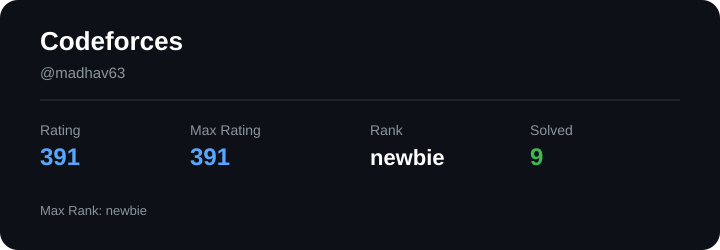
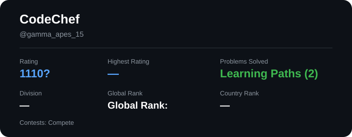
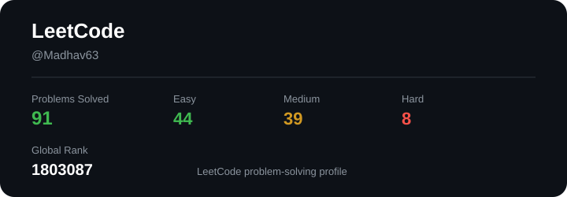
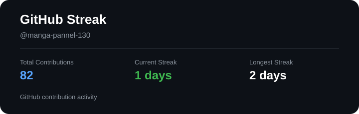

  <picture>
    <source media="(prefers-color-scheme: dark)" srcset="./assets/images/banner-dark.png">
    <source media="(prefers-color-scheme: light)" srcset="./assets/images/banner-light.png">
    
  </picture>

  <h1>Vishal Madhav S</h1>

  <h3>AI Engineer • Building AI Systems & Products</h3>

  

  

  
  &nbsp;
  

  

  

---

## 🧑‍💻 About Me

I'm a Computer Science student focused on **AI engineering and building AI-powered products**.

My interests include **Generative AI, LLM applications, RAG, embeddings, agentic systems, and AI-powered automation**.

---

## 🎯 Focus

|   🤖 AI Engineering   | 🧠 Generative AI |   🔗 Retrieval   |
| :-------------------: | :--------------: | :--------------: |
| AI Systems & Products | LLM Applications | RAG & Embeddings |

|   🧩 Agentic Systems  |     ⚙️ Automation     |      📚 Problem Solving      |
| :-------------------: | :-------------------: | :--------------------------: |
| AI Agents & Workflows | AI-powered Automation | Algorithms & Data Structures |

---

## 🛠️ Tech Stack

### Languages

### AI & Backend

### Frontend

### Databases & Tools

---

## 🚀 Featured Builds

### 💸 RecoverAI

AI-assisted payment recovery system that analyses failed transactions, prioritises recovery opportunities, and determines recovery actions.

### 🧠 SkillSense

AI-driven skill assessment and career guidance platform that evaluates skills through assessments and connects them with suitable career paths.

### 🛡️ AI SOC Analyst

AI-assisted security operations project focused on alert prioritisation, investigation workflows, and automated response decision-making.

### ⚙️ HAD

A prototype exploring workflow optimisation across **CAD, FEA, and topology optimisation**.

### 🤖 Hiring Agent

AI recruiter that evaluates candidates against job requirements using resume information and automated candidate analysis.

  

---

## 🧩 Coding Profiles

### Codeforces

 

### CodeChef

 

### LeetCode

---

## 📊 GitHub Statistics

&nbsp;

  

---

## 🐍 Contribution Activity

<picture>
  <source media="(prefers-color-scheme: dark)" srcset="https://raw.githubusercontent.com/manga-pannel-130/manga-pannel-130/output/github-contribution-grid-snake-dark.svg">
  <source media="(prefers-color-scheme: light)" srcset="https://raw.githubusercontent.com/manga-pannel-130/manga-pannel-130/output/github-contribution-grid-snake.svg">
  
</picture>

---

## 🌐 Connect With Me

&nbsp;

&nbsp;

  Thanks for visiting.

